## 🚀 실행 방법 (Usage Guide)

---

### 🔧 1) 가상환경 & 설치

```bash
conda create -n emotion-effnet python=3.10 -y
conda activate emotion-effnet
pip install -r requirements.txt

# 환경별 PyTorch 설치 권장
# CUDA 12.1:
pip install torch torchvision torchaudio --index-url https://download.pytorch.org/whl/cu121

# CPU 전용:
pip install torch torchvision torchaudio --index-url https://download.pytorch.org/whl/cpu

# macOS (MPS):
pip install torch torchvision torchaudio

### 📂 2) 데이터 배치
data/train|val|test/ 하위에 7개 클래스 폴더 생성
anger, disgust, fear, happy, neutral, panic, sadness

예시:
data/train/happy/*.jpg
data/val/sadness/*.png

### 🏋️ 3) 학습
python -m src.utils.train --cfg configs/default.yaml

### 📊 4) 평가
python -m src.utils.evaluate --cfg configs/default.yaml --split val --plot
python -m src.utils.evaluate --cfg configs/default.yaml --split test --plot

### 🔍 5) 추론
python -m src.utils.test --cfg configs/default.yaml --input path/to/image_or_dir

### 📤 6) 내보내기 (TorchScript / CoreML)
# TorchScript
python -m src.utils.export_torchscript --cfg configs/default.yaml \
    --out exports/torchscript/efficientnet_b0_ts_v1.pt

# CoreML (macOS 권장, FP16 권장)
python -m src.utils.export_coreml --cfg configs/default.yaml --fp16 \
    --out exports/coreml/EmotionClassifier_v1.mlmodel

### ⚙️ 7) 옵션 (CLI 덮어쓰기 예시)
# 날짜 기반 run_dir
python -m src.utils.train --cfg configs/default.yaml \
    --run_dir runs/$(date +%F)_effb0_cb-focal_bs128_ep35

# Loss 변경
python -m src.utils.train --cfg configs/default.yaml \
    --loss cb_focal --run_dir runs/effb0_cb-focal_try

# 이미지 크기, 러닝레이트, 배치사이즈, epoch 변경
python -m src.utils.train --cfg configs/default.yaml \
    --img_size 256 --lr 4e-4 --batch_size 96 --epochs 30 \
    --run_dir runs/effb0_sz256_lr4e4_bs96_ep30
```

---

## 📂 Source Code Overview (`src/`)

---

### 🗂 datasets

### `datasets/emotion_dataset.py`

- **`build_transforms(img_size=224)`**
  학습/평가용 전처리(transform) 정의 (Resize, Flip·ColorJitter, ToTensor, Normalize).
- **`build_datasets(data_root, img_size)`**
  `ImageFolder`로 `train/val(/test)` 데이터셋 생성.
- **`build_loaders(data_root, img_size, batch_size, num_workers=8, drop_last=True)`**
  위 데이터셋으로 DataLoader 3종(train/val/test) 반환.

---

## 🗂 engine

### `engine/trainer.py`

- **`_amp_ctx_and_scaler(device, enabled)`**
  AMP 지원 시 `autocast`, `GradScaler` 반환.
- **`evaluate(model, loader, device)`**
  모델 평가 → `macro-F1`와 `(y_true, y_pred)` 반환.
- **`train_one_epoch(...)`**
  1 epoch 학습. AMP/스케줄러 지원. 평균 loss 반환.

---

### 🗂 losses

### `losses/focal.py`

- **`FocalLoss`**
  CrossEntropy 기반 focal loss.
  `loss = ((1 - pt)^γ) * CE`

### `losses/cb_focal.py`

- **`ClassBalancedFocal`**
  클래스 분포 기반 가중치 적용 후 focal loss.
- **`LogitAdjustedCE`**
  클래스 priors 기반으로 로짓 보정한 CE loss.

### `losses/__init__.py`

- 통합 import: `FocalLoss`, `ClassBalancedFocal`, `LogitAdjustedCE`.

---

### 🗂 models

### `models/efficientnet.py`

- **`build_efficientnet_b0(num_classes, pretrained)`**
  EfficientNet-B0 불러와 classifier를 `Linear(num_classes)`로 교체.
- **`build_model(name, num_classes, pretrained)`**
  현재 `"efficientnet_b0"`만 지원.

---

### 🗂 utils

### `utils/common.py`

- **`load_cfg(path)`** : YAML 설정 → `SimpleNamespace` 변환.
- **`set_seed(seed)`** : random/numpy/torch 시드 고정.
- **`get_device(pref)`** : `"cuda" | "mps" | "cpu"` 결정.
- **`ensure_dir(p)`** : 디렉토리 생성.
- **`override_cfg(cfg, **kvs)`\*\* : CLI 인자로 config 덮어쓰기.

### `utils/evaluate.py`

- **`main()`** : 모델 로드 후 val/test 평가.
- 출력: macro-F1, classification report(txt), confusion matrix(npy).
- `--plot` 옵션: per-class F1 막대그래프 저장.

### `utils/inference.py`

- **`build_infer_tf(img_size)`** : 추론용 전처리 생성.
- **`predict_image(model, img_path, device, tf, class_names)`** :
  단일 이미지 추론 → `(pred_label, confidence, prob_dist)` 반환.

### `utils/metrics.py`

- **`macro_f1(y_true, y_pred)`** : macro-F1 계산.
- **`full_report(y_true, y_pred, target_names)`** : classification report + confusion matrix.

### `utils/mixup.py`

- **`rand_bbox(size, lam)`** : CutMix bounding box 생성.
- **`remix_lambda(...)`** : 클래스 빈도 기반 λ 보정.
- **`apply_mix(...)`** : MixUp 적용.
- **`apply_cutmix(...)`** : CutMix 적용.
- **`mixup_cutmix_remix(...)`** : cfg 옵션에 따라 MixUp/CutMix/Remix 실행.

### `utils/plot.py`

- **`save_history(run_dir, history)`** : 학습 이력 JSON 저장.
- **`plot_curve(y, title, ylabel, out_path)`** : 학습 곡선 시각화.
- **`plot_bar(labels, values, title, out_path)`** : per-class 성능 막대그래프.

### `utils/sampler.py`

- **`make_class_aware_sampler(samples)`**
  클래스 불균형 대응 `WeightedRandomSampler` + 클래스 개수 반환.

### `utils/test.py`

- **`main()`** : 단일 이미지/폴더 예측 후 CSV(`predictions.csv`) 저장.
- CSV 컬럼: `path, pred, conf, p_<class...>`

### `utils/train.py`

- **`parse_args()`** : CLI 인자 파싱.
- **`build_loss(cfg, train_set)`** : 설정에 맞는 loss 객체 생성.
- **`main()`** :
  - config 로드/덮어쓰기 → 시드/디바이스 설정
  - 데이터로더/모델/optimizer/scheduler/loss 초기화
  - epoch 루프: 학습 → 평가 → 기록 저장
  - 최고 성능 모델 저장(`best.pt`), 곡선 그래프 및 리포트 출력

⸻

### 📊 Workflow Diagram

```mermaid
flowchart TD

subgraph DATA[데이터셋]
    A1["이미지 폴더 train/val/test"] --> A2[build_transforms]
    A2 --> A3[build_loaders]
end

subgraph MODEL[모델]
    B1["build_model EfficientNet-B0"]
    B2["Linear classifier (7 classes)"]
    B1 --> B2
end

subgraph TRAIN[학습]
    C1[train_one_epoch]
    C2["evaluate (val)"]
    C3["loss functions (CE, Focal, CB-Focal, LogitAdjusted)"]
    C1 --> C2
    C3 --> C1
end

subgraph UTILS[유틸]
    D1["metrics.py - macroF1"]
    D2["plot.py - curves & bars"]
    D3["sampler.py - class-aware"]
    D4["mixup.py - mixup/cutmix/remix"]
end

DATA --> TRAIN
MODEL --> TRAIN
TRAIN -->|best.pt 저장| CKPT[(Checkpoint)]
CKPT --> E1[evaluate.py]
CKPT --> E2[test.py]
CKPT --> E3[inference.py]
```


